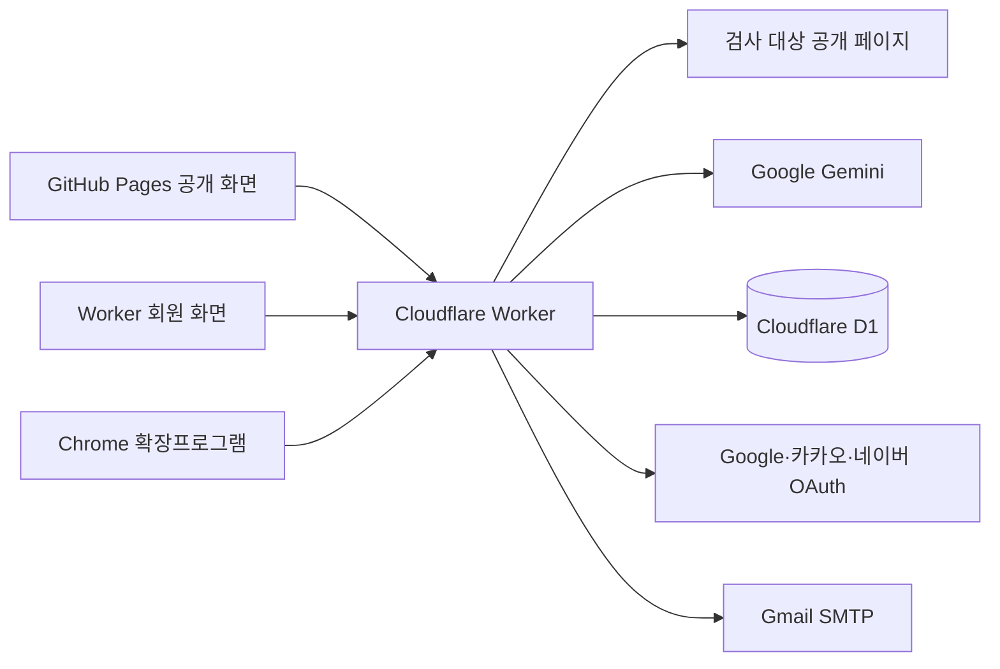

# 현재 기능과 검증 상태

업데이트: 2026-09-17 (Asia/Seoul)
기준 커밋: 문서와 같은 `main` 브랜치

가게 체크는 쇼핑몰의 공개 페이지를 읽어 **AI가 이해할 기본 정보**와 **고객이 구매 전에 확인할 정보**를 나눠 점검한다. 점수는 페이지 준비 상태를 설명하는 자체 진단값이며 검색 순위, AI 추천, 매출 또는 법적 적합성을 보장하지 않는다.

## 운영 주소

| 용도 | 주소 | 상태 |
|---|---|---|
| 제출·공개 체험 | https://alswhitetiger.github.io/ai-visibility-check/ | 운영 중 |
| 로그인·회원 기능 | https://ai-visibility.ai-visibility-worker.workers.dev/ai-visibility-check/ | 운영 중 |
| API 상태 | https://ai-visibility.ai-visibility-worker.workers.dev/api/health | 운영 중 |
| 공개 저장소 | https://github.com/alswhitetiger/ai-visibility-check | `main` 자동 배포 |

GitHub Pages에서는 예시와 익명 검사를 제공한다. 로그인, 사이트 저장, 검사 이력처럼 쿠키가 필요한 기능은 Worker와 같은 도메인의 회원 화면에서 제공한다.

## 사용자 기능

### 1. 공개 페이지 진단

- URL 하나를 입력해 홈페이지 또는 상품 상세페이지를 검사한다.
- 로그인하지 않은 방문자는 IP 기준 하루 1회 실제 검사를 체험할 수 있다.
- 실제 사이트를 쓰지 않아도 가상의 전후 예시를 즉시 볼 수 있다.
- `robots.txt`를 답변용 AI 크롤러와 학습용 크롤러로 구분한다. 학습용 차단은 점수에서 제외한다.
- `llms.txt`, `sitemap.xml`, canonical, Organization·Product 구조화 데이터, 원본 HTML 텍스트, 제목, 설명, 모바일 viewport, 이미지 대체 텍스트, 가격, OG 태그, 사업자 정보 등 15개 항목을 확인한다.
- 상품 구조화 데이터와 가격은 상품 페이지에서만 채점한다.
- 로그인·성인인증 전용 화면, 봇 차단 화면, 접근 거부, 알 수 없는 `robots.txt` 응답은 억지로 점수화하지 않는다.
- AI 정보 점수와 고객 정보 점수를 2축으로 보여주고, 먼저 고칠 항목 3개와 근거 URL을 제공한다.
- 동일 검사 버전의 결과는 최대 24시간 재사용해 대상 사이트와 AI API 호출을 줄인다.

### 2. 수정 지원

- 발견된 문제마다 쉬운 설명, 수정 방향과 복사 가능한 코드 예시를 제공한다.
- Cafe24·아임웹·스마트스토어·Shopify·워드프레스의 관리자 화면에서 확인할 위치를 안내한다.
- 페이지에서 읽은 브랜드명·설명·연락처 등으로 Organization·WebSite·FAQ 구조화 데이터 초안을 만든다.
- 사용자가 실제 반영 여부를 기록하는 개선 체크리스트를 계정에 저장한다.
- 같은 브라우저의 이전 검사와 재검사 결과를 비교한다.

### 3. Gemini 보조 기능

운영 환경에는 Gemini만 연결되어 있다. 규칙 기반 진단은 Gemini가 실패해도 별도로 동작한다.

- **브랜드 설명 확인:** 브랜드명과 도메인을 알려준 뒤 Gemini가 알고 있는 정보와 오정보 가능성을 별도 영역에 표시한다.
- **소개 문구 초안:** 페이지에서 읽은 제한된 근거만 사용해 제목·설명 초안 3개를 만든다. 사용자가 사실 확인에 동의해야 복사할 수 있다.
- **고객 질문 검사:** 상품·조건·비용·배송·교환/문의 질문 5개에 답할 근거가 있는지 확인한다. 인용문이 실제 수집 자료에 포함됐는지 서버에서 검증한다.
- **운영자 인터뷰:** 운영자의 답변 5개로 소개 문구와 FAQ 3개, FAQ JSON-LD 초안을 만든다. 답변과 초안은 공용 검사 캐시나 회원 이력에 저장하지 않는다.
- **브랜드 비노출 발견성 검사:** Gemini에는 브랜드명과 주소를 보내지 않고 소비자 질문만 보낸 뒤 답변에 현재 브랜드가 등장했는지 확인한다.

AI 생성이 실패한 요청은 개인·서비스 한도에서 되돌려 준다. 생성 결과는 제안이며 사실과 정책은 운영자가 확인해야 한다.

### 4. 회원과 로그인

- 이메일·비밀번호 가입, 6자리 이메일 인증번호, 로그인과 로그아웃
- 아이디 찾기, 비밀번호 재설정, 로그인 상태의 비밀번호 변경
- Google·카카오·네이버 OAuth 로그인과 기존 계정에 소셜 계정 연결
- 이메일이 같다는 이유만으로 계정을 자동 합치지 않는 안전한 연결 정책
- 내 사이트 최대 50개 저장·이름 변경·삭제
- 최근 90일 검사 이력 조회·개별 삭제
- 계정당 하루 20회 검사, 한국 시간 자정 초기화
- 회원 탈퇴 시 계정, 세션, 로그인 연결, 사이트, 이력, 사용량, 체크리스트와 공유 보고서 삭제

### 5. 여러 페이지 점검과 비교 공유

- 공개 `robots.txt`의 Sitemap 선언과 기본 `/sitemap.xml`을 읽어 같은 호스트의 핵심 페이지를 최대 5개 추천한다.
- 메인·상품·배송·교환/환불·FAQ 페이지 2~5개를 묶어 순서대로 검사한다.
- 사이트맵 추천만으로 검사 횟수를 차감하지 않는다. 실제 묶음 검사에서는 새 페이지마다 1회를 사용한다.
- 같은 URL의 검사 이력 두 건을 전후 비교해 점수 변화, 개선된 항목과 다시 확인할 항목을 보여준다.
- 단일 결과와 전후 비교 결과를 30일 읽기 전용 링크로 공유한다.
- 공유 데이터는 화면에서 받은 점수를 믿지 않고 서버가 로그인 사용자의 실제 이력을 다시 읽어 만든다.
- 한 계정에는 최근 공유 링크 30개만 유지한다.
- 비교 보고서는 브라우저 인쇄 기능으로 PDF 저장할 수 있다.

### 6. Chrome 확장프로그램

- 사용자가 직접 연 현재 탭에서 제목, 설명, H1·H2, 이미지 `alt`, 가격 후보를 읽는다.
- 추출 내용을 먼저 보여주고 사용자가 전송을 눌러야 서버로 보낸다.
- 비밀번호와 쿠키는 읽지 않는다.
- 공개 URL 검사와 입력 자료가 다르므로 확장 점수는 참고용이며 회원 이력에 합산하지 않는다.
- 계정·주문 페이지에서는 사용하지 않도록 화면과 문서에 안내한다.

### 7. 소유자 동의 공개 사례

- 사이트 소유자가 메타태그 또는 `/.well-known/ai-visibility-check.txt`로 제어권을 확인한 경우에만 공개 사례 목록에 등록한다.
- 제3자 사이트를 임의로 순위화하거나 공개 사례로 게시하지 않는다.
- 현재 운영 공개 사례는 0건이다. 기능 오류가 아니라 소유권 확인과 공개 동의가 완료된 사례가 아직 없기 때문이다.

## 구조

- `web/`: React 19 + Vite 화면
- `worker/`: Cloudflare Worker API, 진단 엔진, Better Auth, Gemini 연동
- `worker/schema.sql`, `worker/migrations/`: D1 스키마와 회원 데이터
- `extension/`: Manifest V3 Chrome 확장프로그램
- `scripts/`: 가상 예시 생성과 조사 스크립트
- `docs/`: 배포·회원·제출·검증 문서

## 보안과 데이터 처리

- HTTP(S) 공개 URL만 허용하고 IP 주소, 내부 호스트, 자격 증명이 들어간 URL을 거부한다.
- 리디렉션도 다시 검사하며 소유권 확인과 사이트맵 요청은 같은 출처 이동만 허용한다.
- 원격 응답은 요청당 10초, 본문 2MB로 제한한다.
- 변경 요청은 허용된 Origin인지 검사한다.
- 세션 쿠키는 HttpOnly, HTTPS에서 Secure, SameSite=Lax로 설정한다.
- 비밀번호는 Better Auth의 scrypt 해시로 저장하고 OAuth 토큰은 `AUTH_SECRET`으로 암호화한다.
- 이메일 인증번호는 원문 대신 해시로 저장하며 10분·5회 시도 제한을 둔다.
- AI 입력은 길이와 자료 범위를 제한하고, AI가 반환한 인용·출처 ID와 JSON 형식을 서버에서 검증한다.
- 공유 링크는 무작위 토큰이며 계정 소유 이력만 공유할 수 있다.

## 운영 한도와 보관 기간

| 항목 | 한도·기간 |
|---|---|
| 익명 실제 검사 | IP당 하루 1회 |
| 회원 실제 검사 | 계정당 하루 20회 |
| 전체 실제 검사 | 하루 400회 |
| AI 초안 + 고객 질문 | IP당 하루 5회, 전체 하루 100회 |
| 운영자 인터뷰 | IP당 하루 3회, 전체 하루 100회 |
| 브랜드 비노출 검사 | 계정당 하루 3회, 전체 하루 100회 |
| 사이트맵 추천 | 계정당 하루 10회, 전체 하루 500회 |
| 공용 검사 캐시 | 최대 24시간 |
| 회원 검사 이력 | 최근 90일 |
| 공유 링크 | 생성 후 30일, 계정당 최근 30개 |

일일 한도는 한국 시간 자정에 바뀐다. 저장된 결과 조회와 실패한 AI 생성·실패한 회원 검사는 횟수에서 제외한다.

## 2026-09-17 검증 결과

| 검증 | 결과 |
|---|---|
| Worker 단위·회귀 테스트 | 56/56 통과 |
| Vite 프로덕션 빌드 | 통과 |
| 예시 데이터 생성 | 통과 |
| Worker·Web 운영 의존성 감사 | 알려진 취약점 0건 |
| 확장프로그램 JS 문법·ZIP 구성 | 통과, 배포 ZIP과 루트 ZIP 해시 일치 |
| GitHub Pages 배포 | 성공 |
| Cloudflare Worker 상태·정적 화면 | HTTP 200 |
| 운영 통합 점검 | 2026-09-16 기준 25/25 통과 |
| 테스트 데이터 정리 | 임시 회원 0명 확인 |

운영 통합 점검은 상태·설정, 공개 사례 API, 소유권 안내, 세 OAuth 진입 URL, 확장 API, 가입·로그인, 연결 계정 조회, 사이트 저장, 실제 검사 2회, Gemini 응답, 초안, 고객 질문, 인터뷰, 브랜드 비노출 검사, 사이트맵 추천, 이력, 체크리스트, 단일 공유, 비교 공유, 비밀번호 변경과 회원 탈퇴를 포함했다.

외부 계정의 최종 동의 화면과 실제 받은편지함 수신은 자동 점검으로 대신할 수 없다. 세 OAuth 설정과 진입 URL은 현재 활성 상태이며, 실제 OAuth 복귀와 Gmail·네이버 메일 수신은 별도 수동 점검 기록이 있다. Chrome 확장프로그램의 실제 탭 권한과 PDF 저장 대화상자도 브라우저에서 최종 확인하는 항목이다.

## 현재 제한사항

- 사이트가 공개 사이트맵을 제공하지 않으면 자동 추천은 홈페이지 한 개만 반환할 수 있다. 사용자는 주소를 직접 추가할 수 있다.
- JavaScript 렌더링 뒤에만 보이는 내용, 로그인 뒤 내용과 결제 과정은 서버 공개 URL 검사로 확인하지 않는다.
- 브랜드 비노출 검사는 한 번의 질문에 대한 한 모델의 응답이며 실제 검색량이나 전체 AI 서비스의 노출을 뜻하지 않는다.
- PDF는 서버가 파일을 생성하는 방식이 아니라 브라우저의 인쇄·PDF 저장 기능을 이용한다.
- 공개 개선 사례는 실제 운영자 동의와 수정 전후 근거가 확보될 때만 추가한다.
